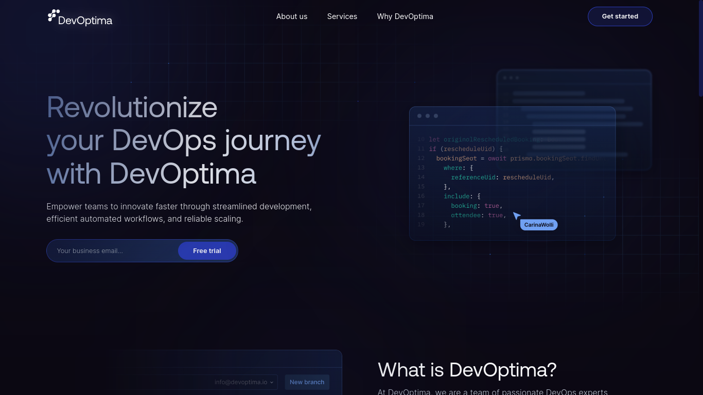

# Frontend Mentor - Pricing component with toggle solution

[Pixel Point Task Figma](https://www.figma.com/file/KkDhKFu3wcVYbDJB0bmFzL/Landing-page-for-dev-test-task?node-id=124%3A1038&mode=dev).

## Table of contents

- [Screenshot](#screenshot)
- [Link](#link)
- [My process](#my-process)
  - [Built with](#built-with)
- [Author](#author)

### Screenshot

### Link

- Site URL: [Live Demo](https://pixel-point-task.netlify.app/)

## My process

### Built with

- Semantic HTML5 markup
- CSS Tailwindcss
- Flexbox & Grid
- Javascript
- nextJs
- react-hook-form
- zod 

## Author

- Website - [Hikmat](https://www.hikmatbek.uz)
- repositories - [@HikmatKhiva Task Pixel Point](https://github.com/HikmatKhiva/task)
